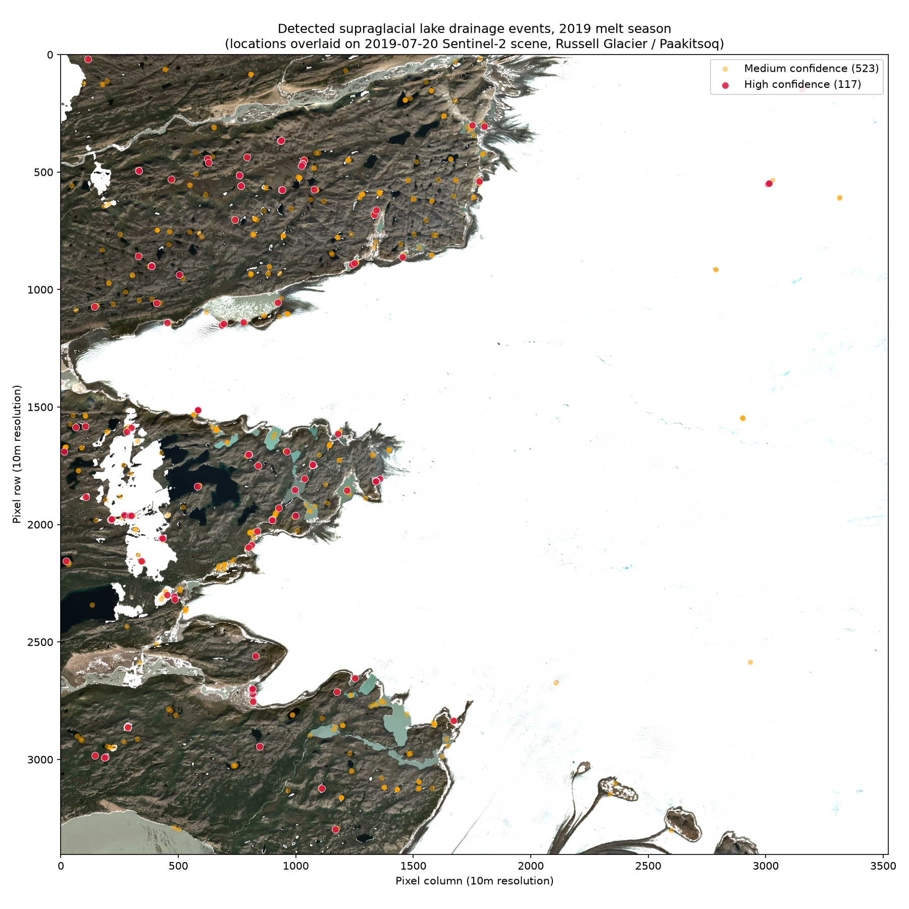
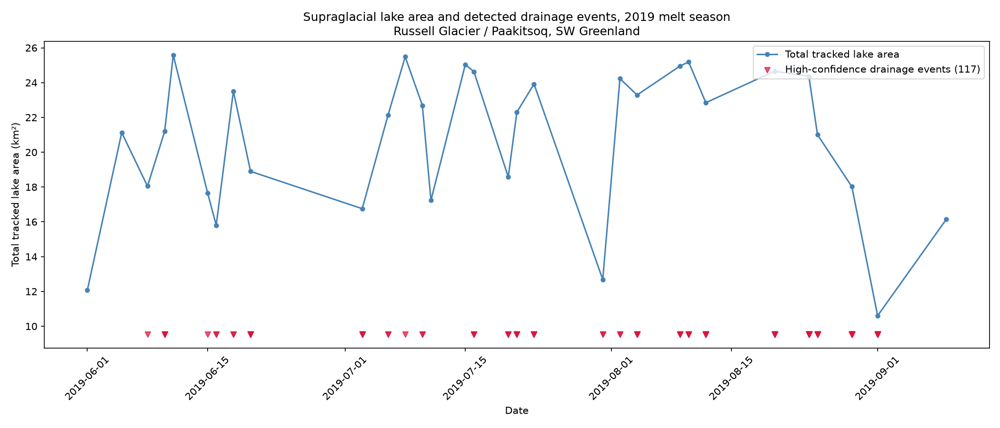
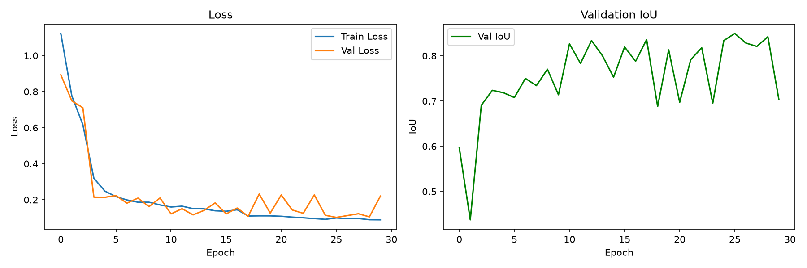
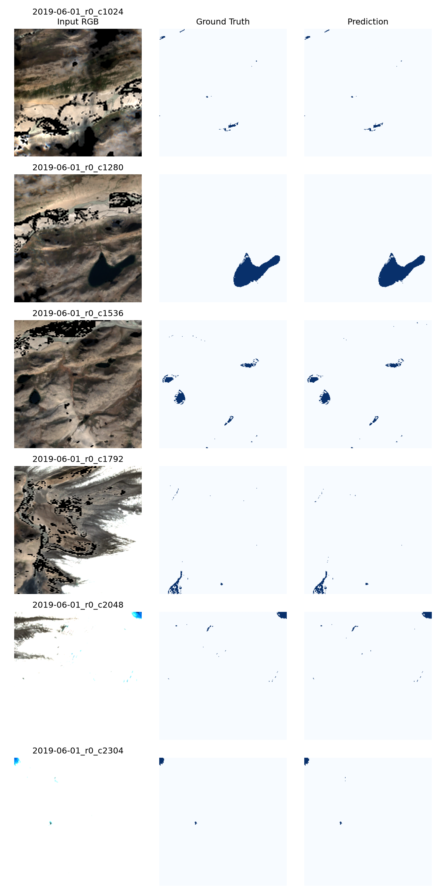
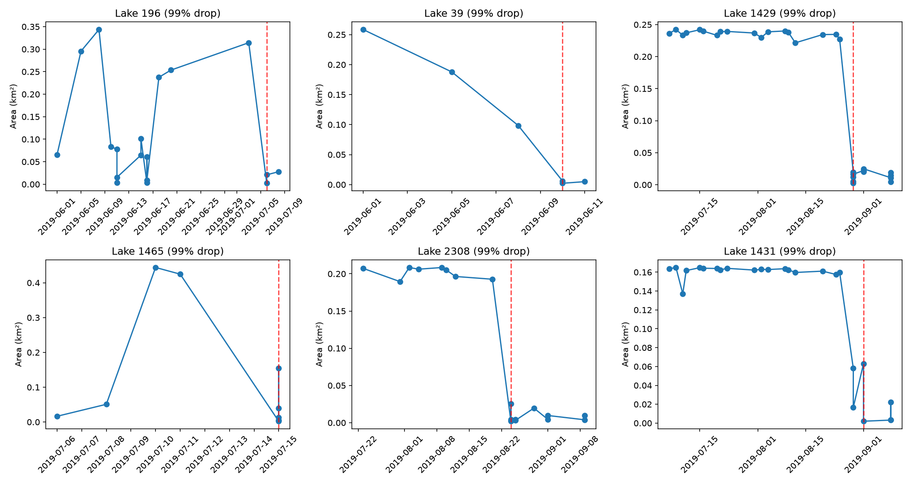
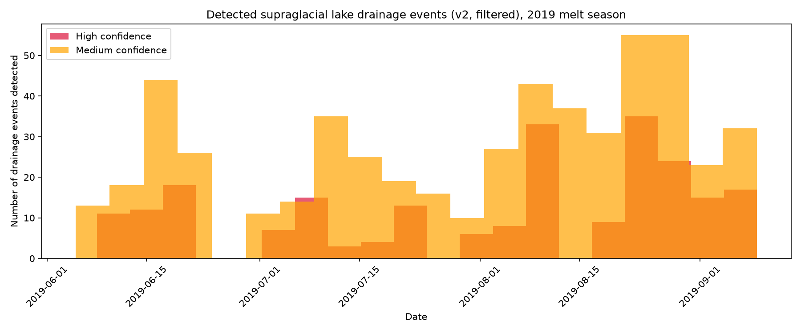
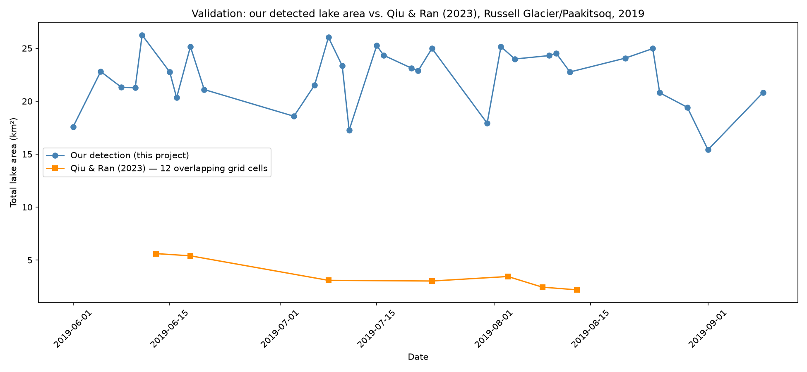
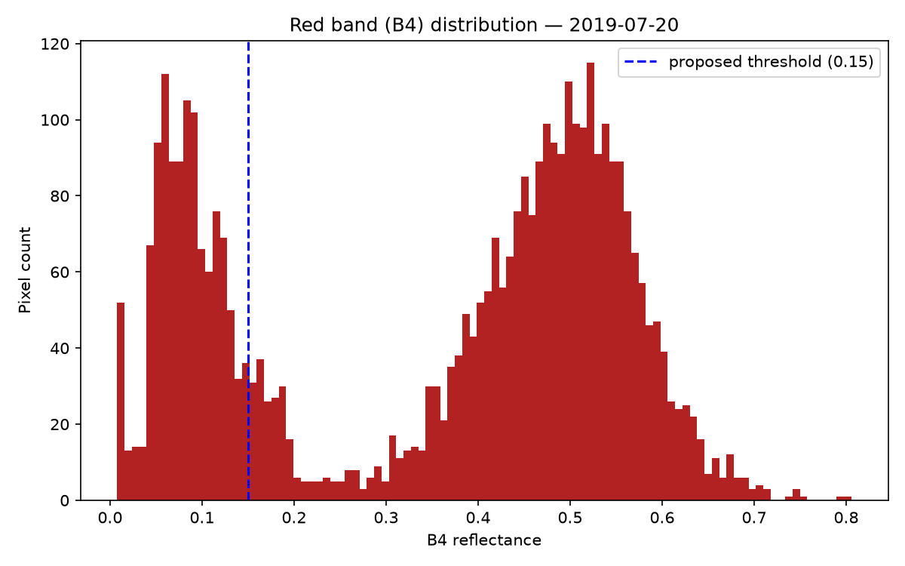
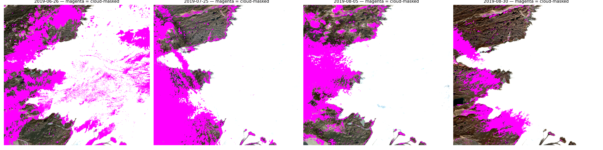

# Supraglacial Lake Monitor


A deep learning pipeline for detecting, tracking, and identifying drainage events in supraglacial lakes on the Greenland Ice Sheet, built as a research oriented portfolio project in glaciology and geospatial AI.

**Pilot region:** Russell Glacier / Paakitsoq, SW Greenland
**Melt season:** 2019 (Greenland's most extreme melt year on record)
**Core method:** U-Net semantic segmentation (PyTorch) on Sentinel-2 imagery → connected-component lake tracking → drainage event detection

---

## Why this project

Supraglacial lake drainage events where meltwater ponding on the ice sheet surface suddenly drains through hydrofracture to the ice sheet bed  are an active area of glaciological research, with implications for ice flow dynamics and mass balance. This project builds a scoped, independent version of the detect → track → analyze pipeline used in that kind of research: CNN based segmentation on optical satellite imagery, cross date tracking of individual lakes, and identification of drainage events from the resulting time series.

---

## Pipeline overview

```
Sentinel-2 imagery (Earth Engine)
        │
        ▼
Cloud masking (SCL band)
        │
        ▼
Bootstrap labeling (NDWI + red band threshold)
        │
        ▼
U-Net training (PyTorch, 6-channel input)
        │
        ▼
Full scene inference + connected component lake extraction
        │
        ▼
Cross date lake tracking (persistence filtered)
        │
        ▼
Drainage event detection (stability filtered)
        │
        ▼
Validation against independent Greenland wide dataset
```

---

## Key results

| Metric | Value |
|---|---|
| Sentinel-2 scenes processed | 35 (31 after excluding cloud contaminated dates) |
| U-Net test set IoU | 0.842 |
| U-Net test set Dice | 0.893 |
| U-Net test set Precision / Recall | 0.872 / 0.957 |
| Lakes tracked across season | 1,846 persistent tracks |
| High confidence drainage events detected | **117** |

**Headline finding:** 117 high confidence supraglacial lake drainage events detected across the 2019 melt season in the pilot region, a ~6.6% drainage rate among stable tracks, consistent in order of magnitude with the ~10% GrIS wide hydrofracture drainage rate reported in Selmes et al.

### Where drainage events occurred



Detected drainage event locations overlaid on a mid season Sentinel-2 scene events cluster along the ice margin and melt zone, as expected physically.

### Season overview



Total tracked lake area across the season with high confidence drainage events marked ties detection and drainage into a single narrative view.

### Training performance



Training and validation loss track closely for the first several epochs; later validation noise was diagnosed as a small validation set effect (only 4 distinct dates), not overfitting confirmed by clean held out test set performance below.

### Model predictions vs. ground truth



Held out test set (6 dates, never seen during training/validation) predicted lake masks closely track ground truth across both large single lakes and scattered small ponds.

### Drainage detection examples



Representative high confidence drainage events: gradual lake fill over multiple observations, followed by a sharp, non recovering area collapse the physical signature of hydrofracture drainage.

### Drainage events across the season



### External validation



Comparison against an independent Greenland wide dataset (Qiu & Ran, 2023) for the same region/season a real, only partially explained discrepancy in absolute lake area (see Limitations below).

---

## Methodology notes (the debugging trail matters here)

This project's real value isn't just the final numbers it's the iterative validation process used to get there. A few examples that shaped the final methodology:

- **Naive NDWI thresholding failed initially**, flagging dry snow as "lake" due to a known spectral artifact (snow's slight green/NIR reflectance asymmetry). Adding a SWIR band didn't fix it SWIR can't distinguish snow from water, only water+snow from rock/cloud. The actual fix was a **red band brightness constraint**: liquid water absorbs red light strongly, snow/ice reflects it confirmed via histogram analysis showing a clean bimodal separation.
- **Whole scene cloud filters weren't AOI-specific.** Several dates showed implausible area crashes that instantly recovered the next scene a mask overlay visualization confirmed cloud was concentrated specifically over the lake dense melt zone even when overall scene cloud cover passed the standard threshold.
- **Raw model predictions produced ~36,000 "lake instances"** across the season mostly speckle noise from the model's ~13% false positive rate. A size distribution histogram showed no clean noise/signal separation (consistent with real power law lake size distributions), so **temporal persistence**  requiring a lake to be matched across multiple dates  did the real filtering work instead.
- **Naive drainage detection flagged 67% of tracks** as "draining," which isn't physically credible. Visual inspection of example curves revealed specific failure patterns (instant single frame spikes, fragile 2-point tracks, repeated oscillation) each was addressed with a targeted, physically motivated filter rather than an arbitrary threshold tweak.
- **External validation against an independent Greenland wide dataset (Qiu & Ran, 2023) revealed a real, only partially explained ~6-10x discrepancy** in absolute lake area. Rather than dismissing or hiding this, it was investigated (geometric footprint check, literature cross reference) and is documented as an open limitation see below.
- **Cross checking the tracking output through two independently built visualizations (a spatial map and a seasonal summary plot) surfaced a real data bug** — the two figures reported inconsistent event counts from the same underlying data, which shouldn't happen. Root cause: the cross date matching logic allowed one lake to incorrectly split into multiple tracks under the same ID (~17% of tracking rows affected). Fixed via strict one-to-one matching, verified with an automated zero duplicates check. All downstream results were regenerated and finalized after the fix. This is arguably the most important debugging step in the project proof that validating a pipeline from multiple independent angles catches real errors that a single sanity check would miss.

<details>
<summary><b>Diagnostic evidence (click to expand)</b> the figures behind the claims above</summary>

**Labeling fix** - red band histogram showing the clean bimodal separation (dark water/terrain vs. bright snow/ice) that justified adding a red band constraint:



**Cloud contamination diagnosis** — magenta overlay showing cloud/shadow concentrated specifically over the lake dense melt zone, invisible to whole scene cloud filters:



**Noise vs. signal diagnosis** — lake instance size distribution showing no clean size based cutoff between real lakes and speckle noise, motivating the persistence based filtering approach in Phase 4:


</details>

---

## Known limitations

- **Single region, single season.** All training and validation data comes from one AOI and one melt year. Model generalization to other regions/seasons is untested.
- **Validation season-scale discrepancy is unresolved.** Our detected lake area is ~6-10x higher than an independent dataset's estimate for the same region/season. Investigation ruled out a geometric comparison artifact; plausible contributing factors include resolution differences (10m vs. 30m Landsat), sampling density (31 vs. 7 usable dates), and possible false positive inflation in our own pipeline (test precision: 87%). Flagged as a priority for future work.
- **Small validation set during training** (4 dates) caused visible noise in validation loss during training mitigated by checkpoint selection, confirmed not to be true overfitting via clean test set performance, but a larger validation set would be more robust.
- **~25% of tracked lakes** appear in only the minimum 2 dates required for persistence borderline cases treated with appropriate caution in the drainage catalog.

---

## Repo structure

```
supraglacial-lake-monitor/
├── 01_s2_data_pull.py              Sentinel-2 acquisition (Earth Engine)
├── 02_ndwi_labeling.py             Bootstrap labeling + full season time series
├── 03_export_training_data.py      Export labeled imagery to Drive for training
├── 04_generate_patches.py          Tile GeoTIFFs into U-Net training patches
├── 05_train_unet.py                U-Net architecture + training loop (PyTorch)
├── 06_evaluate_unet.py             Test set evaluation
├── 07_lake_instance_extraction.py  Full scene inference + connected components
├── 07b_instance_size_diagnostic.py Size distribution diagnostic (Phase 4)
├── 08_lake_tracking.py             Cross date lake tracking (1:1 matching, bug-fixed)
├── 08b_check_duplicate_tracks.py   Duplicate track diagnostic that caught the bug
├── 09_drainage_detection.py        Drainage event detection (stability filtered)
├── 10_validate_*.py                External validation vs. Qiu & Ran (2023)
├── 11_spatial_drainage_map.py      Spatial visualization
├── 12_seasonal_summary_hero.py     Season overview visualization
├── figures/                        All output figures
├── data/                           Raw/processed imagery, patches, lake instances (gitignored)
├── best_unet_model.pt              Trained model checkpoint
└── *.csv                           Output result tables
```

---

## Data sources

- **Sentinel-2 L2A** (ESA/Copernicus) via Google Earth Engine
- **Qiu, J. & Ran, J. (2023).** *Greenland-wide assessment of supraglacial lake area fluctuations between 2017 and 2022.* Zenodo. [doi.org/10.5281/zenodo.13924069](https://doi.org/10.5281/zenodo.13924069). CC BY 4.0. Used for external validation.

## Tech stack

Python · PyTorch (U-Net, trained on Apple Silicon MPS) · Google Earth Engine API · rasterio · scipy (connected-component labeling) · pandas · matplotlib

## License

Code: MIT (add explicit LICENSE file if distributing). Sentinel-2 imagery: ESA/Copernicus open data. Validation dataset: CC BY 4.0, Qiu & Ran (2023).
